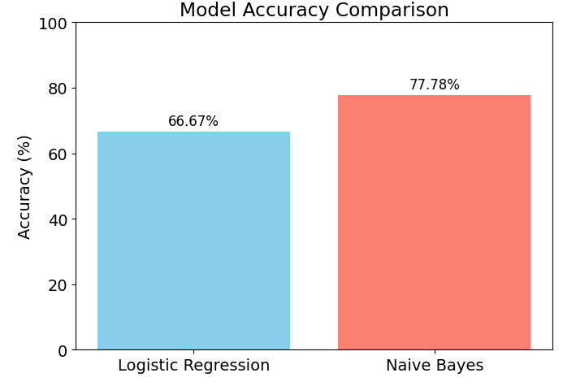

# Logistic Regression and Naive Bayes Classification

This project demonstrates how to use Logistic Regression and Naive Bayes classifiers on a structured dataset. The script loads, preprocesses, and encodes the data, then trains and evaluates both models, printing their accuracy.

## Prerequisites
- Python 3.x
- Required packages:
  - pandas
  - numpy
  - matplotlib
  - scikit-learn

## Setup
1. Place your dataset (e.g., `Data1.csv`) in the specified path. Update the path in the script if needed.
2. Install required packages using pip:
   ```powershell
   pip install pandas numpy matplotlib scikit-learn
   ```

## How to Run
1. Open a terminal in the project directory.
2. Run the script:
   ```powershell
   python Logistic_Regression_Model.py
   ```
3. The script will output the accuracy of both models and display a bar chart comparing their accuracy.

## Notes
- Make sure the dataset matches the expected column names and format.
- You can modify the script to use a different dataset or adjust preprocessing as needed.


## Output Example
```
Accuracy LogisticRegression Model: 66.67
Accuracy Naive Bayes Model: 77.78
```

After running, a bar chart will also appear, visually comparing the accuracy of both models:



## Author
- [Arsalan Modirkhazeni]
- Date: October 20, 2025
